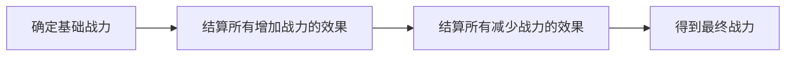

## 战力计算须知
当你需要计算一个单位的战力时，遵循 **“先加后减”** 和 **“锁定机制”** 的原则

## 先加后减

 

1. [确定基础战力](#1-确定基础战力)  
2. [结算所有增加战力的效果](#2-结算所有增加战力的效果)
3. [结算所有减少战力的效果](#3-结算所有减少战力的效果。)  
4. [得到最终战力](#4-得到最终战力)  

## 锁定机制
当增加/减少战力的一次性效果生效时，会“锁定”这个数值。  
也就是说，它不会因为之后再有加战力或减战力的效果而改变。

**例子：**

 
<!-- tab 加战力例子 -->

  
  
  

防守方拥有【强强魄罗】（2 战力，【坚守】+1 战力 = 3 战力）和【阿狸，嫣然狐媚】（4 战力）。【强强魄罗】受到了【聚合变异】的影响，战力需要增加至与【阿狸，嫣然狐媚】相同，也就是 +1 战力。由于【聚合变异】是一次性效果，会受到 **锁定机制** 的影响，因此锁定为 +1 战力。之后在重新计算时，【强强魄罗】依旧是 +1 战力，而不会变成 +2 战力去再次追平【阿狸，嫣然狐媚】的战力。
 
<!-- endtab -->
 
<!-- tab 减战力例子-->
 

  
  

防守方的【强强魄罗】（2 战力，且具有【坚守】）受到了【烟幕弹】的影响（-4 战力，最低不得低于 1）。由于【烟幕弹】的效果不能使战力低于 1，所以最终只结算为 -2 战力。这是一次性效果，会受到 **锁定机制** 的影响，因此被锁定为 -2 战力。以后在重新计算时，依旧是 -2 战力，而不是 -4 战力。

<!-- endtab -->
 


## 详细说明

### 1. 确定基础战力
- 每个单位卡牌都有一个 **基础战力数值**
- 大多数单位的基础战力标示在 **卡牌右上角**

### 2. 结算所有增加战力的效果
1. 检查所有会 **增加战力** 的效果，例如传奇、装备、法术、关键词、单位本身拥有的效果等
    - 一次性效果需要注意**锁定机制**
2. 把这些数值 **相加**，得到增加战力效果

### 3. 结算所有减少战力的效果
1. 检查所有会 **减少战力** 的效果，例如敌方技能等
    - 一次性效果需要注意**锁定机制**
2. 把这些数值 **相加**，得到减少战力效果

### 4. 得到最终战力（**“先加后减”**）
最终战力 = 基础战力 + 增加战力效果 - 减少战力效果
- 如果最终战力小于或等于 0 战力单位时，他将被视为 0 战力。如果该单位没承受任何伤害，它会保持存活直到受到任何伤害。

## 实例

### 例子 1
防守方的【强强魄罗】（2 战力，且拥有【坚守】）受到了【烟幕弹】的影响（-4 战力，最低 1）。最终战力为 1。
它先从【坚守】获得 +1 战力，变为 3 战力；然后【烟幕弹】生效，锁定为 -2，战力降至最低 1。

> 计算过程：
> 基础 2 战力 +【坚守】（+1）+【烟幕弹】（-2）
> 2 + 1 - 2 = 1 战力

如果在此战斗中打出【秘奥义！慈悲度魂落】（+2 战力，若为【增益】则额外 +1），并选择目标为【强强魄罗】。【烟幕弹】的 -2 已被锁定，不会重新计算。

> 计算过程：
> 基础 2 战力 +【坚守】(+1) + 增益（+1）+【秘奥义！慈悲度魂落】（+1） +【烟幕弹】（-2）
> 2 + 3 - 2 = 3 战力

战斗结束后，【坚守】失效，单位只剩：基础 2 战力 + 【秘奥义！慈悲度魂落】(+2) +【烟幕弹】(-2) = 2 战力。

> 计算过程：
> 基础 2 战力 + 增益（+1）+【秘奥义！慈悲度魂落】（+1） +【烟幕弹】（-2）
> 2 + 2 - 2 = 2 战力

若未曾打出【秘奥义！慈悲度魂落】，战斗结束后，【坚守】失效，单位只剩：基础 2 战力 +【烟幕弹】（-2）= 0 战力。结果是 0 战力单位，但它仍能存活，直到受到任何伤害。

> 计算过程：
> 基础 2 战力 +【烟幕弹】（-2）
> 2 - 2 = 0 战力

### 例子 2

【强强魄罗】（2 战力）移动到【崔法利兵营】（在此处时 +1 战力），战力变为 3。若此时受到【“敲”诈】的影响，最终为 2 战力。

> 计算过程：
> 基础 2 战力 + 【崔法利兵营】（+1）+【“敲”诈】（-1）
> 2 + 1 - 1 = 2 战力

当它离开【崔法利兵营】时，+1 战力的效果停止生效，而【“敲”诈】的 -2 已被锁定。于是它将成为一个 1 战力单位。

> 计算过程：
> 基础 2 战力 +【“敲”诈】（-1）
> 2 - 1 = 1 战力

### 例子 3
【蕾欧娜-献身者】：她会令所在战场的所有【眩晕】单位 -8 战力，并且该效果最后生效。她的技能不是一次性效果 不会受到 **锁定机制**。因此大多数情况下，这些单位都会以 1 战力收场（除非原本战力达到 10 以上）。